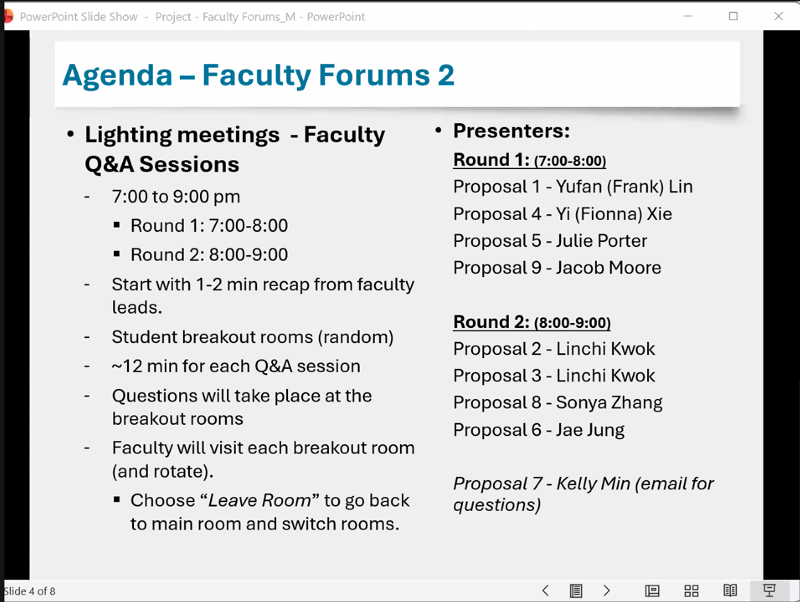

# W00 - August 20

**Syllabus Pending**

- [Review CEP MSDM Timeline Website](https://www.cppmsdm.com/capstone_project#sec-project-milestones-and-timelines)

- Review CEP Summer Presentation

  - [Video](https://streaming.cpp.edu/media/MSDM%20Culminating%20Experience%20Project%20Information%20Session%20-%20July%209%2C%202026/1_ytmjgtux)

  - [Slides](https://jaejungca.github.io/CEP-Info-Session/cep_info_session.html#/title-slide)

::: callout-important
This class covers Ch 1 & 3 of CEP
:::

- CEP Notion

  - Plan Weekly meetings/checkin with groups

  - Add Timeline Milestones

  - Calendar with deadlines

  - Prepare Agenda for all meetings with faculty

    - Share with faculty advisers prior to meeting

- [Formatting Instructions For Written Report](https://www.cppmsdm.com/cep-content-format-template#sec-abstract)

  - If using Quarto, just copy the code from webpage

- Same number of AOs as number of group members

- Group research via Zotero

  - Invite professors to sync

## Due Dates

### M00-1: Aug 26

- ✅ Introduce Yourself

- ✅ Secondary Databased Research Preparation

### M00-2: Aug 26

- Quiz

- CH 9 Marketing Research Challenge

### M01: Aug 27

- DS-L01-1-Introduction to R Principle Assignment

- DS-L01-2-Rmd Principle Assignment

- Quiz - Ch01 - Introduction to Marketing Research

# Resources

## Books/Software for Research Projects:

Students may select the resources they need depending on the stage and nature of their research projects at any time, but the professor will provide guidance.

**Marketing Research:**

- Malhotra, Naresh K., *Basic Marketing Research,* Prentice Hall.

- Journal articles will be assigned (in class or Blackboard).

**Consumer Behavior/Psychology**

- [Consumer Behavior by]{.underline} Kardes, Cronley, and Cline (available in the center)

**Research Methods in Social Science:**

- Aronson, Elliot, Phoebe C. Ellsworth, J. Merrill Carlsmith, and Marti Hope Gonzales (1990), *Methods of Research in Social Psychology* (2^nd^ edition), New York: McGraw-Hill; [will be provided at no cost.]{.underline}

- Sternberg, Robert J. (1989), [The Psychologist’s Companion; A Guide to Scientific Writing for Students and Researchers]{.underline} (3^rd^ edition), Cambridge: Cambridge University Press.

**Writing/Grammar**

- Strunk, William and E. B. White (2000), *The Elements of Style*, 4^th^ edition, Boston: Pearson.

**Data Science/Analytics:**

- *Modern Dive:* [https://moderndive.netlify.com/index.htmlLinks to an external site.](https://moderndive.netlify.com/index.html)

- [Links to an external site.](https://moderndive.netlify.com/index.html)*R for Data Science:* [https://r4ds.had.co.nz/data-visualisation.htmlLinks to an external site.](https://r4ds.had.co.nz/data-visualisation.html)

- *Text Mining with R: A Tidy Approach,* [https://www.tidytextmining.com/index.htmlLinks to an external site.](https://www.tidytextmining.com/index.html)

- *Data Mining Techniques: For Marketing, Sales, and Customer Relationship Management* by Gordon S. Linoff and Michael A. Berry, Most recent edition, Wiley.

- *An Introduction to Statistical Learning with Applications in R* by Gareth James, Daniela Witten, Trevor Hastie, and Robert Tibshirani, Most recent edition, Springer.

- *Mastering Social Media Mining with R: Extract valuable data from your social media sites and make better business decisions using R* by Sharan Kumar Ravindran and Vikram Garg, Most recent edition, Packt Publishing.

- *R for Everyone* by Jared P. Lander, Most recent edition, Addison-Wesley.

**Software To Be Adopted**:

- See syllabus

## Go through the study cycle:

- Preview Module --\> Work on the Module--\> Review after the class --\> Study --\> Assess your learning

## Four Elements of Effective Feedback

1.  **Positive** - Comment on a Positive/Strength First (Should always start with a positive phrase).

2.  **Solution** - Offer a solution with an example from the course for them to implement/incorporate. 

3.  **Respectful** - Be sensitive and don't be harsh. 

4.  **RFI (Room For Improvement)** Even if the peer's response is good there is always room for improvement. Providing feedback or suggesting new ideas is always valuable to the person being reviewed. 

# W01 - August 27

- Next Monday - Faculty Research Forum

- Review Sample Projects in GP00

  - He especially likes Jarrod's presentation (RSMT)

- IC2-1: Individual, focused on CEP topic

- GP01: Group activity, combining sources, using Zotero

  - mind grammar of citation

- use quarto for written reports

  - copy code from [cppmsdm.com/cep-content-format-template](https://www.cppmsdm.com/cep-content-format-template)

    - see this page for Zotero style repository that can be uploaded to doc

  - .scss to control style formatting to be added by Dr. Jung later

- recall Jarrod's form submission for project sections

- type your name next to your sections that you work on

  - each member needs one objective

  - translate into analytics objectives

  - designed to lead to meaningful recommendation

- Meet with Faculty Lead [**weekly or bi-weekly**]{.underline}

- In the event that you have to build infrastructure from the beginning, that counts as implementation

- Most groups had trouble completing data collection

  - [**START EARLY:**]{.underline} **it doesn't work during winter break; avoid spring collection**

- ***Project objectives are not the same as analytics objectives***, and we need both

- IRB Approval

  - most challenging task – start early

## Due Dates

### M01: Sep 2

- IC1-2: Digesting Peer-Reviewed Research Article

- M01-1-Quarto-Visual Mode Assignment

- M01-2-Application Assignment

# W02 - September 03

# W03 - Sept. 10

- We are assigned to Dr. Linchi Kwok – Project 3: Building Sustainable Demand for The Restaurant at Kellogg Ranch (Kwok)

- **Email Dr. Kwok for kickoff meeting + share emails**

  - we should meet every other week with faculty, alternate with each other

- Review Kwok's proposal THOROUGHLY

  - [proposal](https://livecsupomona-my.sharepoint.com/:w:/r/personal/jmjung_cpp_edu/_layouts/15/Doc.aspx?sourcedoc=%7BEE8AA299-86CA-4B96-9BE3-3F6869D8F0E2%7D&file=P3%20-%20MSDM_CEP_RKR%20(Kwok).docx&action=default&mobileredirect=true)

  - [presentation](https://livecsupomona-my.sharepoint.com/:p:/r/personal/jmjung_cpp_edu/_layouts/15/Doc.aspx?sourcedoc=%7B79357237-50BB-486E-9CFD-2E9B12DD1B80%7D&file=P3%20-%20MSDM_CEP_RKR%20(Kwok).pptx&action=edit&mobileredirect=true)

- Review updated syllabus & upcoming assignments/modules

# W05 - Sept. 24

Research Process

1.  Defining the problem
2.  Developing an Approach to the Problem
    - Conduct exploratory research
      - opinions of industry expert, analysis of secondary data, qualitative research, pilot studies
    - Formulate research questions & hypotheses
      - including thoretical framework, analytical models
3.  Formulate research Design
    1.  methods for collecting quatitative data
    2.  Measurement and scale
    3.  Questionaire design
    4.  sampling process and sample size

what information do I need to have a great digital marketing plan

- should be related to other marketing objectives

- project object CANNOT be digital marketing plan

- analytics objective is vague

  - identify other variable can i use to address analytics objective

  - exploratory; not conclusive

  - similar to research question

  - no clear answers
